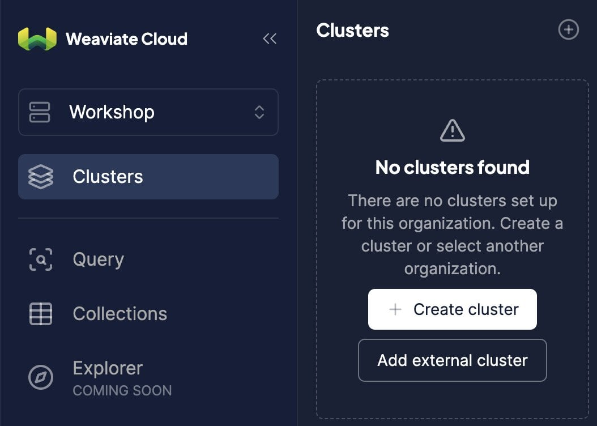
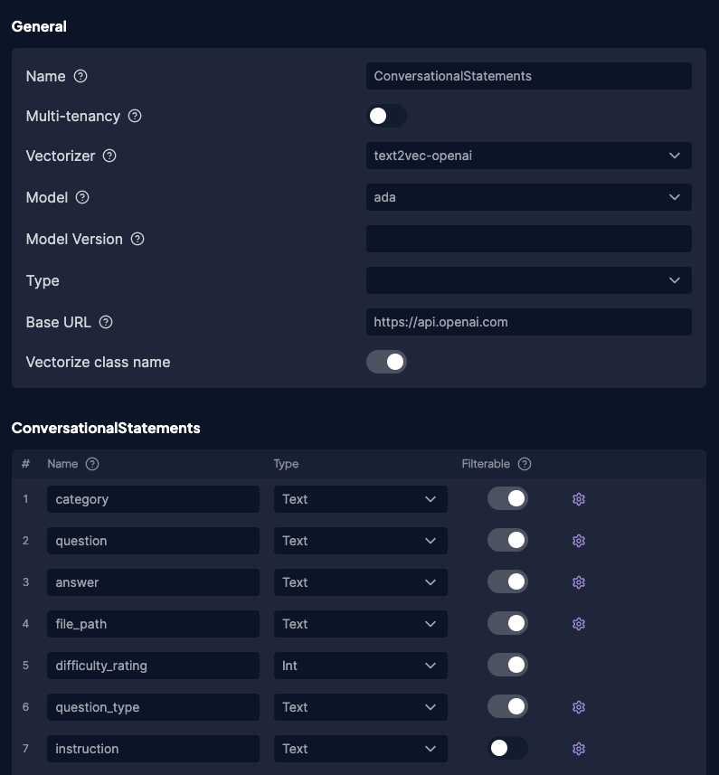

# Introduction
Code for the Wealingo language app we demoed during [Confluent Current 2024](https://www.confluent.io/resources/generic/current-2024-recap/).


# Prerequisites

1. A Kafka cluster (we used [Confluent Cloud](https://www.confluent.io/confluent-cloud/))
2. A Weaviate instance (sign up for a free 14-day [sandbox account](https://console.weaviate.cloud/) here)
3. A postgresql database (we used [AWS RDS](https://aws.amazon.com/rds/))
4. CDC set up between the postgresql database and a kafka topic (we used Debezium's [postgresql connector](https://debezium.io/documentation/reference/stable/connectors/postgresql.html))
5. A spark cluster with [spark-connector](https://github.com/weaviate/spark-connector) installed (we used [Databricks](https://www.databricks.com/spark/about))
6. API keys for embedding and generative models, like OpenAI, Cohere etc.


# Setup

The app is put together with these components below:
- Backend: Django
- Frontend UI: Flutter
- DB: Weaviate and PostgreSQL

## Setup Backend and UI
The `docker-compose.yml` file in the root folder sets up the django server and Postgres instance in the backend along with the flutter UI. Create a `.env` file in the same folder as the `docker-compose.yml` and set the following values

```
DB_HOST=localhost
DB_PORT=5430
DB_NAME=wealingo
DB_USER=postgres
DB_PASSWORD=[ac35...]
``` 

You can also set up the front end by installing `Flutter` and running the following to deploy the web version of wealingo

```
flutter build web
flutter run
```
For the django backend, you can also use it's python interactive shell by running the following commands in the server/wealingo folder 

```
python manage.py runserver 
```

## Setup Weaviate

**Create a Weaviate instance**

There are several ways to create a Weaviate instance, listed [here](https://weaviate.io/developers/weaviate/installation).

For Wealingo, we created a Weaviate Cloud instance. To create a sandbox cluster, follow these steps:
+ Select the "Free sandbox" tab.
+ Give your cluster a name. WCD adds a random suffix to sandbox cluster names to ensure uniqueness.
+ Verify that "Enable Authentication?" is set to "Yes".
+ Click create.  

It takes a minute or two to create the new cluster. When the cluster is ready, WCD displays a check mark (✔️) next to the cluster name.






## Setup PostgreSQL
Once the Postgres instance is up, create a database `wealingo` and a superuser with admin privileges so that you can connect to the instance. In the `.env` file, set the `DB_USER` and `DB_PASSWORD` to these values. 

Django lets you create these with its API that you can call via the interactive Python shell in `manage.py`. You'll find this in the server/wealingo folder. 

```
python manage.py createsuperuser
```  
The schema for the postgres instance is defined in the `models.py` class. 
To setup the schema, go to the server folder in the wealingo project, and execute the following commands. Django 

```
python manage.py makemigrations wealingo
python manage.py migrate
```


## Setup Spark-Connector

Run the [notebook](./spark-connector/wealingo_stream_new_questions.ipynb) located in the spark-connector folder within your Spark cluster to set up streaming DataFrames that read from the Kafka topic and write to your Weaviate instance.